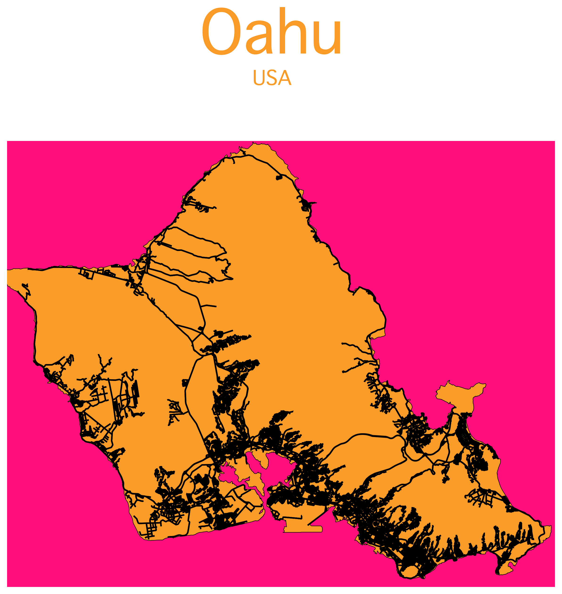
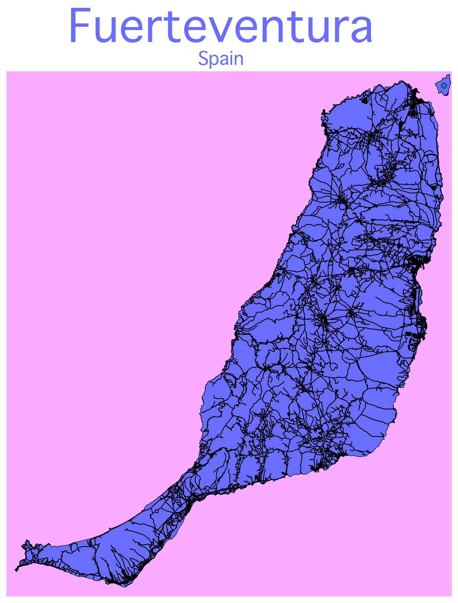
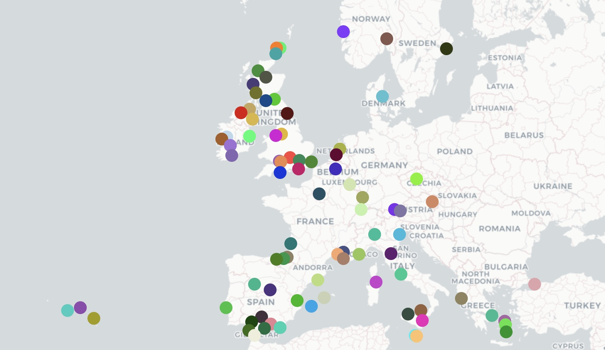

# Maps

*A quiet exploration of space and place through code.*

---

## ⚪ The Essence

This repository serves as a curated collection of cartographic experiments and tools. It brings together various geospatial libraries—Folium, Geopandas, OSMnx, and QGIS—to weave data into visual narratives. From the intricate street networks of islands to interactive travel logs, this project seeks to find the beauty in coordinates and boundaries.

---

## 📂 The Collection

A breakdown of the diverse mapping projects housed within.

### 🏝️ Boundaries & Networks
*Focus: OSMnx, Urban Form*

This section explores the skeletal structure of islands and cities. By stripping away the noise, we visualize the organic growth of road networks and coastlines. The `urban_travel_graphs` folder contains a gallery of these generated "portraits" of places.

*   **Key Scripts:** `OSMnx/`, `GIS_project/`
*   **Gallery:** `urban_travel_graphs/`

| Oahu, Hawaii | Fuerteventura, Spain |
| :---: | :---: |
|  |  |

### 🧭 Interactive Journeys
*Focus: Folium, Web Maps*

Web-based maps designed for exploration. These projects range from personal travel histories (`MyTravelMap`) to detailed, region-specific guides like the Fuerteventura project (`travelMapsProject`). They utilize `Folium` to create interactive markers, popups, and layers.

*   **Projects:** `MyTravelMap/`, `travelMapsProject/`
*   **Code:** `Folium/`, `tryouts/`



### 📐 The Analysis
*Focus: Geopandas, DuckDB, QGIS*

The analytical engine. Here, we move beyond visualization to computation. Scripts in `GIS_project` and `geopandas` calculate metrics like walkability scores, analyze urban growth patterns, and manipulate administrative boundaries (`Shapefiles`).

*   **Core Logic:** `GIS_project/WalkabilityScoreCalculator.py`, `UrbanGrothPattern.py`
*   **Data:** `GeospatialDataAnalysisUsingDuckDB/`

### 🎞️ Motion
*Focus: Matplotlib Animation*

Capturing the dimension of time. This module uses `matplotlib` to generate animated visualizations, such as earthquake scatterplots, bringing static data to life.

*   **See:** `matplotlibs/`

---

## 🌿 The Layout

A simplified view of the workspace structure.

```text
/
├── Folium/             ◦ Interactive plotting and visualization
├── geopandas/          ◦ Spatial data manipulation and analysis
├── GeospatialAPIs/     ◦ Data fetching and integration
├── GIS_project/        ◦ Core analysis scripts (Walkability, Urban Growth)
├── matplotlibs/        ◦ Animated plots and GIFs
├── MyTravelMap/        ◦ Personal travel history visualizations
├── OSMnx/              ◦ Street networks and urban forms
├── QGis/               ◦ Desktop GIS project files
├── travelMapsProject/  ◦ Specific regional mapping (Fuerteventura)
└── urban_travel_graphs/◦ Generated visual artifacts (The Gallery)
```

---

## 🪵 Getting Started

To begin your cartographic journey, establish a quiet environment.

1.  **Create the environment**
    ```bash
    python3 -m venv maps_env
    source maps_env/bin/activate
    ```

2.  **Install dependencies**
    Ensure you have the necessary libraries (e.g., `folium`, `geopandas`, `osmnx`, `matplotlib`) installed.

    ```bash
    pip install folium geopandas osmnx matplotlib
    ```

---

*“Map making is the writing of the earth.”*
